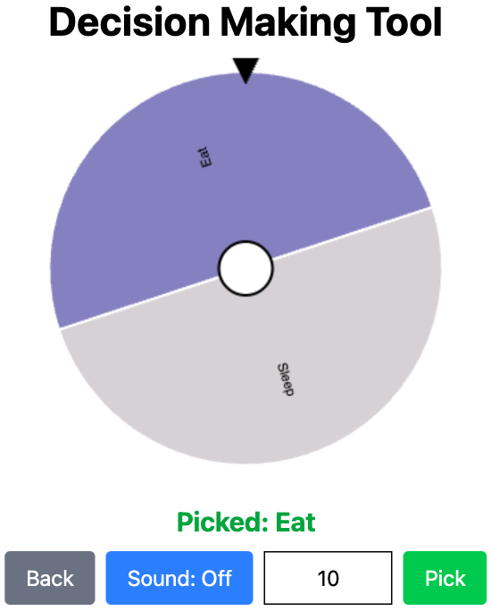

### Single page application for decision making

This application is designed to help to make random pick based on the weight of an option (it increases the chance of an option being picked).

The application consists of two parts: `List of Options` and `Decision Picker`.

The first part of the application (`List of Options`) allows you to edit the list of options, as well as to save it to a file and load it from a file. There is also a button to go to the second part of the application (`Decision Picker`).

The second part of the application (`Decision Picker`) allows you to visualize the previously created list. There is also an element for displaying the picked option, a button to start the picking process and a user-friendly option to return to the first part of the application (`List of Options`).
